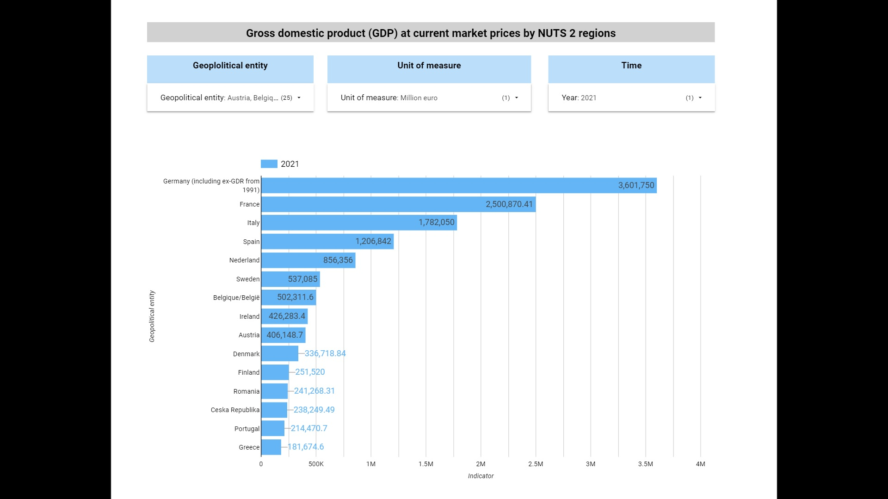
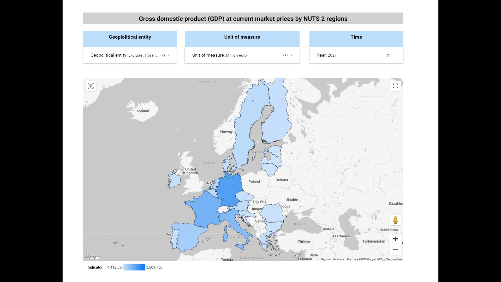
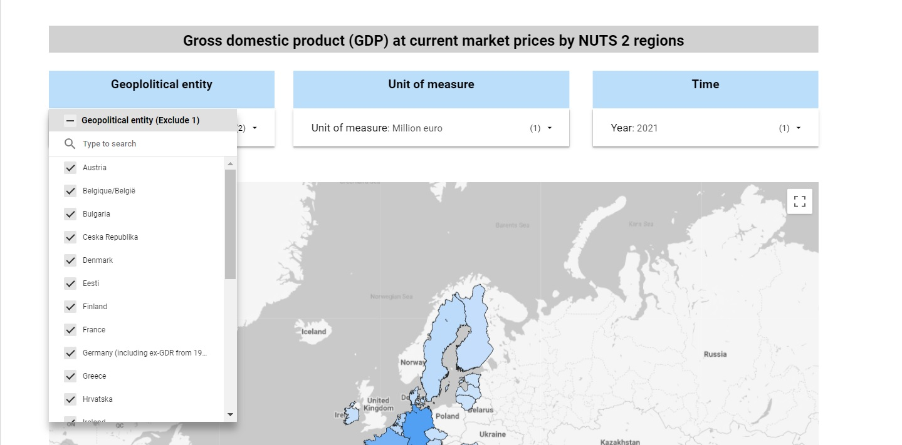
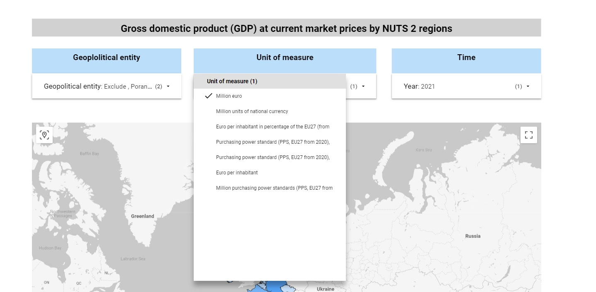
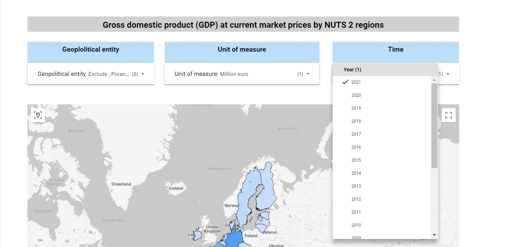

>[Back to index](../README.md)

# Dashboard implementation notes

- The dashboard used in this project was created in the Google Looker Studio. 
- The Looker Studio is treated in the project as Front-End visualization tool only. All table joins and other actions, required for the visualization, were made by the dbt Cloud.
- Due to the fact that Looker Studio Google Geo charts [doesn't support NUTs regions](https://support.google.com/looker-studio/answer/9843174#country&zippy=%2Cin-this-article), the "Map" page of the dashbord represents data for Country level regions only. The details regarding the NUTs regions you can find [here.](https://ec.europa.eu/eurostat/web/nuts/background)
- The dashbord is based on the dataset `eurostat_gdp_prod_core.facts_gdp_joined` from the corresponding DB Prod environment.
- **The restricted link at the dashboard you can find** [**here.**](https://lookerstudio.google.com/reporting/5cb1caed-76fb-4a2f-bbd3-b9e2bb8269b1) This link is restricted in order to avoid additional charging. The dashboard screenshots are provided in the next section.

## Dashboard visualizations

The dashboard consist of tree pages: Table, Bar, Map.

**Table:**

**Bar:**

**Map:**

Each page contains three drop boxes with the input parameters:

**Geoplolitical entity:**

**Unit of measure:**

**Time:**

