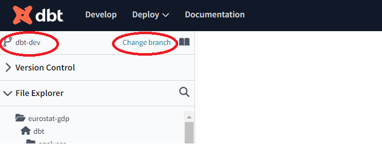
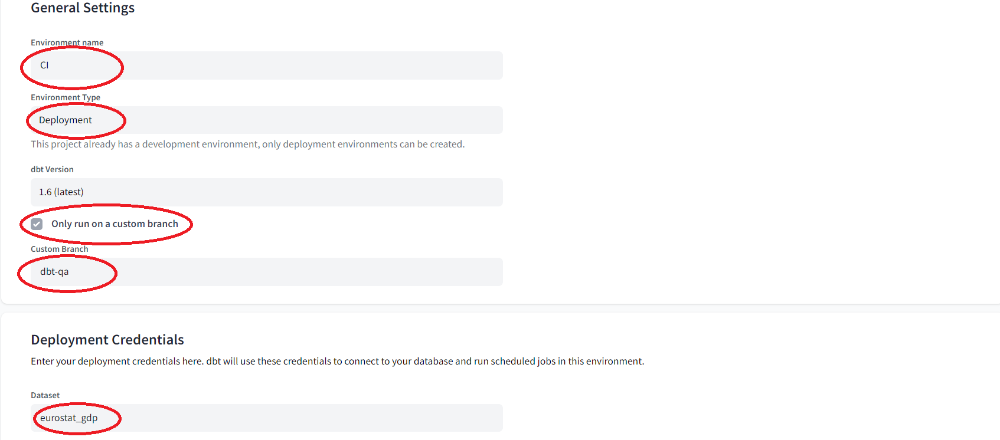

## 1. General suppositions.
- It is supposed that the dbt project team contains separate dev and qa teams.
- It is supposed that the dbt project has 3 basic environments: dev, qa and prod.
- It is supposed that the dbt project has 1 additional continuous integration environment: ci. 
- It is supposed that each basic environment contains its own GitHub branch and DB schemas.
  - dev environment contains:
      - GitHub branch: `dbt-dev`
      - DB schema: `eurostat_gdp_dev`
  - qa environment contains:
      - GitHub branch: `dbt-qa` 
      - DB schemas: `eurostat_gdp_qa_staging` and `eurostat_gdp_qa_core`. Intermediate non-core DB objects are carried over into the separate staging schema in order to simplify the work of the end-users.
  - prod environment contains:
      - GitHub branch: `dbt-prod`. This branch is used to separate dbt code from the other code in the repository which is stored in the main branch. 
      - DB schemas: `eurostat_gdp_prod_staging` and `eurostat_gdp_prod_core`. Intermediate non-core DB objects are carried over into the separate staging schema in order to simplify the work of the end-users.
- It is supposed that a continuous integration job will run when a pull request will be created in **dbt-dev** branch in order to merge changes to the **dbt-qa** branch. 
- The following configuration steps reflect these suppositions.

## 2. Setting up dbt Cloud project.
1. Create a [dbt CLoud account](https://www.getdbt.com/signup/) or login to an existing account.
2. Go to **_Account Settings_** -> **_User Profile_** -> **_Personal Profile_** -> **_Linked Accounts_** -> **_Link_** -> **_Authorize dbt Cloud_**
      - Under choosen linked repo account -> Configure integration in GitHub -> Install dbt Cloud -> Install
3. Create a new project in this account: **Account Settings -> Projects -> New Project**
    - **_Project name:_** `eurostat-gdp`
    - **_Advanced Settings -> Project subdirectory_**. Specify the subdirectory of your repository which will contains your dbt project. For details see the following [guide](https://docs.getdbt.com/docs/build/projects#project-subdirectories).
    - Choose a connection: `BigQuery`
    - Configure your environment:
      - **_Connection:_** `BigQuery`
      - Upload a `Service Account JSON file`
      - **_Optional Settings_** section, enter the preferred value in the field **_Location_**. It is a GCP Location where dbt will create new Datasets for your project, i.e `us-east1`.
      - **_Development credentials_** section, field **_Dataset:_** `eurostat_gdp`. 
      - Test the connection and click on **_Continue_** once the connection is tested successfully.
    - Setup a Repository for the dbt project.
      - Choose the corresponding Repository from the provided list. This list is formed based on the information from your Repo account which is linked to your dbt User Profile.
  
## 3. Setting up GitHub repository.
In the selected GitHub repository create the following branches: 
- `dbt-dev`. This is the individual branch of the developer. Each developer from dev team has its own developing branch.
- `dbt-qa`. This branch contains all merged changes from the whole dev team.
- `dbt-prod`. It is actually branch for prod environment.
  
## 4. Configure Dev environment.
- Open dbt Cloud IDE.
- Setup working branch for the IDE: `dbt-dev`
  
    
- Open **_Account Settings_** -> **_User Profile_** -> **_Credentials_** -> **_Development Credentials_**
- Setup **Dataset:** `eurostat_gdp` and **Target Name:** `dev`.

    

## 5. Configure CI environment.
- Create continuous integration environment: **_Deploy_** -> **_Environments_** -> **_Create Environment_**
- Setup the values provided on the following picture during the creation:

   

- Create Deployment job in the CI environment: **_Deploy_** -> **_Jobs_** -> **_Create Job_**
- Setup the values provided on the following picture during the creation:

  

  
